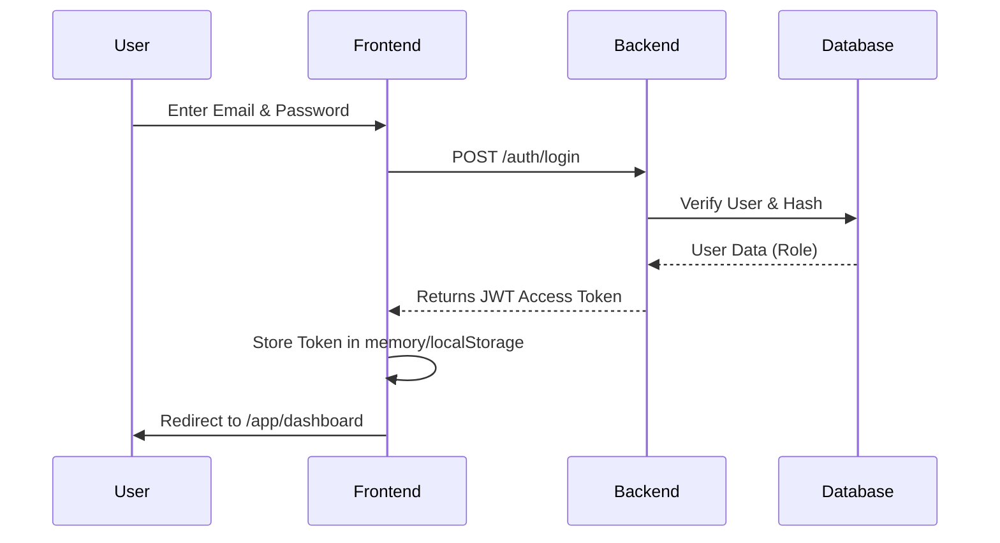
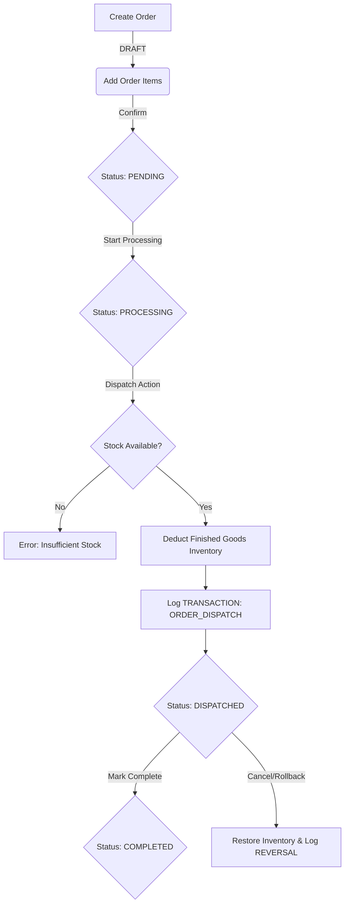
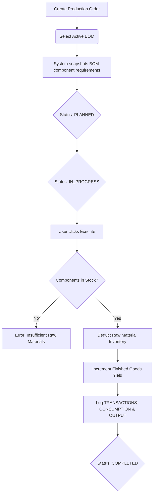
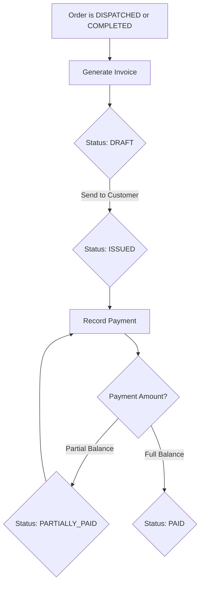
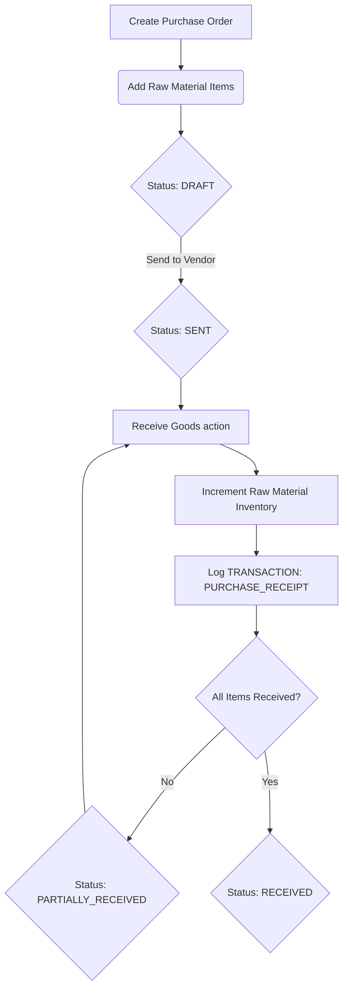
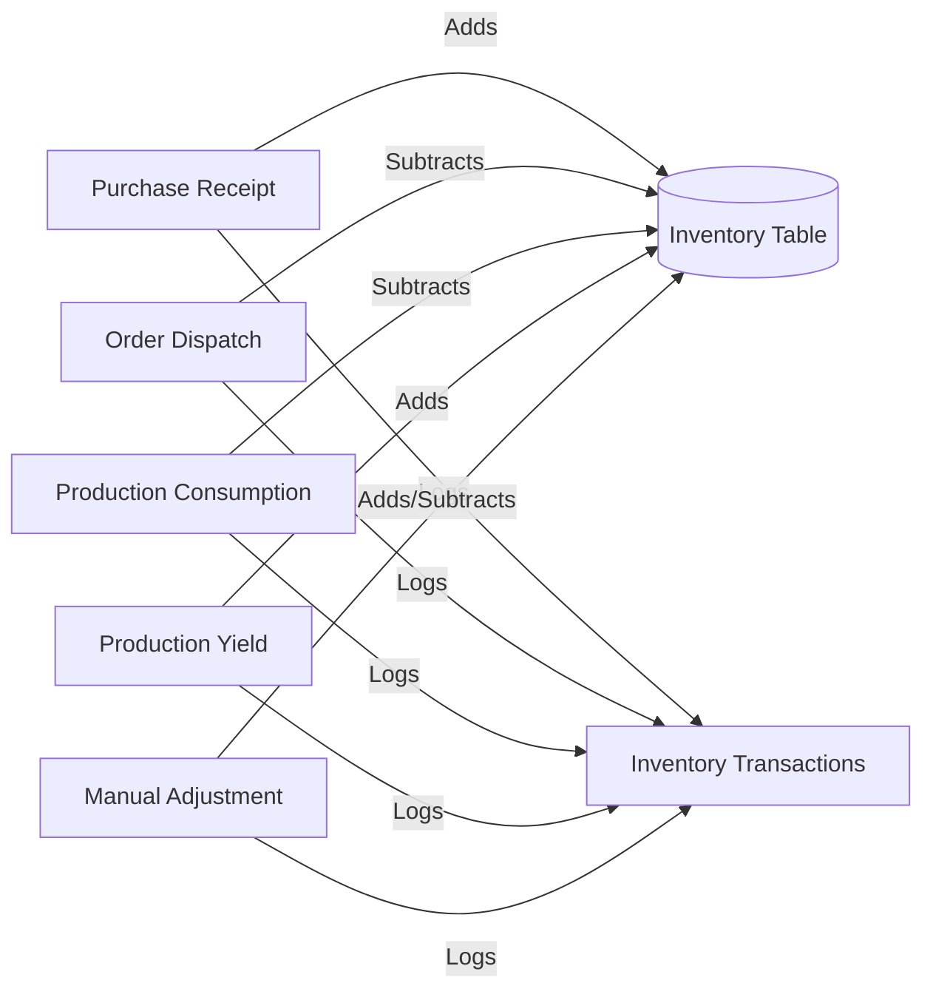

# Application Flow

This document details every major user workflow in the RL-ERP application.

## 1. Authentication Flow
The system uses JWT-based stateless authentication.

## 2. Order Fulfillment Flow
The complete journey of a customer order from creation to dispatch. Note that dispatching automatically handles inventory validation and deduction.

## 3. Production Workflow (BOM & Execution)
This flow tracks how raw materials are converted into finished goods.

## 4. Invoicing and Payment Flow
Financial lifecycle tracking linked directly to dispatched orders.

## 5. Procurement Flow (Purchase Orders)
Procuring raw materials from suppliers.

## 6. Inventory Ledger Flow
All modules eventually route inventory mutations through a central ledger transaction system to maintain an immutable audit trail.

## 7. Error Handling Flow
When a user attempts an invalid action (e.g., executing a production job without stock).

1. **User Action:** Clicks "Execute" in the Frontend.
2. **Frontend Request:** Dispatches `POST /production-orders/{id}/execute`.
3. **Backend Validation:** Service layer identifies a stock deficit.
4. **Backend Response:** Raises `HTTPException` with status `400 Bad Request` and detail `"Insufficient inventory for product ID X"`.
5. **Frontend Interceptor:** Axios catches the `400` error.
6. **User Feedback:** A red toast notification appears globally: "Insufficient inventory for product ID X". No page reload occurs.
