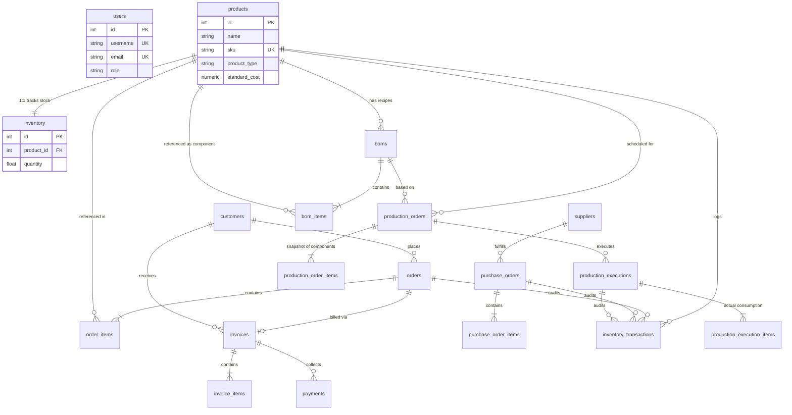

# Backend & Database Schema Reference

This is the definitive reference for the RL-ERP PostgreSQL database schema, SQLAlchemy models, and backend business logic.

## 1. Entity-Relationship Diagram (ERD)

## 2. Core Tables & Definitions

### 2.1 Identity & Access
- **`users`**: Stores authentication credentials (bcrypt hashed) and RBAC roles (`admin`, `manager`, `staff`).

### 2.2 Product Master & Inventory
- **`products`**: Defines all items in the system. Enforces a strict `product_type` enum (`RAW_MATERIAL`, `FINISHED_GOOD`, `SEMI_FINISHED`, `PACKAGING`, `CONSUMABLE`). Holds `standard_cost` for financial valuations.
- **`inventory`**: A 1:1 mapping to `products`. Holds the absolute `quantity` currently in stock and `minimum_stock` for alerts.
- **`inventory_transactions`**: The immutable ledger. Every mutation to the `inventory` table MUST write a row here. Uses `transaction_type` (`SALE`, `PURCHASE_RECEIPT`, `ADJUSTMENT`, `PRODUCTION_CONSUMPTION`, `PRODUCTION_OUTPUT`, `REVERSAL`, `ORDER_DISPATCH`, `ORDER_CANCEL`).

### 2.3 Sales & Fulfillment
- **`customers`**: Client companies. Supports soft-delete (`is_active`).
- **`orders` / `order_items`**: Customer sales orders. Statuses flow: `PENDING` -> `PROCESSING` -> `DISPATCHED` -> `COMPLETED`. Dispatching mutates inventory.
- **`invoices` / `invoice_items`**: Financial documents generated strictly from `orders`. Statuses: `DRAFT` -> `ISSUED` -> `PARTIALLY_PAID` -> `PAID`.
- **`payments`**: Client payments linked to an invoice. Used to calculate outstanding balances and aging reports.

### 2.4 Procurement
- **`suppliers`**: Raw material vendors.
- **`purchase_orders` / `purchase_order_items`**: Procurement lifecycle. Receiving items dynamically increments `inventory.quantity` and writes `PURCHASE_RECEIPT` transactions.

### 2.5 Manufacturing
- **`boms` / `bom_items`**: Bill of Materials. Recipes linking a parent finished good to multiple child raw materials. Only one BOM can be active per product.
- **`production_orders` / `production_order_items`**: A planned job. When created, it *snapshots* the active BOM into `production_order_items` so future BOM changes don't corrupt historical job plans.
- **`production_executions` / `production_execution_items`**: The actual physical run. Deducts component inventory, adds finished goods inventory, and records exact actual vs. planned material usage.

## 3. Business Logic & Constraints

### 3.1 Inventory Mutability
- The `inventory.quantity` field should *never* be updated arbitrarily in standard flows.
- Standard flow updates happen atomically via the `InventoryService` which locks the row, validates sufficient stock, alters the quantity, and writes the `inventory_transactions` log in the same database transaction.

### 3.2 Production Execution & Rollback
When `POST /production-orders/{id}/execute` is called:
1. Validates order is `IN_PROGRESS`.
2. Validates component stock levels against requirements.
3. Atomically mutates inventory: deducts consumed components and adds produced finished good yield.
4. Sets order status to `COMPLETED`.

If a mistake was made, `POST /production-orders/{id}/rollback`:
1. Verifies output finished goods stock is sufficient to deduct (protecting against negative inventory if the goods were already sold).
2. Reverses all inventory updates (adds components stock back and subtracts finished goods).
3. Logs `REVERSAL` transaction types.

### 3.3 Soft Deletion
Entities linked to financial or physical records (Products, Customers, Suppliers) are never hard deleted to preserve referential integrity. They are marked `is_active = False` via a `PATCH` endpoint, hiding them from standard dropdowns and queries while keeping historical documents intact.

## 4. Alembic Migrations
The database schema evolves through versioned migrations managed by Alembic. 
- Never use `Base.metadata.create_all()` in production.
- To apply migrations: `alembic upgrade head`.
- To generate a new migration after updating a SQLAlchemy model: `alembic revision --autogenerate -m "description"`.

## 5. API Module Organization
The API is grouped into semantic routers inside `app/routes/`:
- `/auth`: Login/JWT generation.
- `/admin`: Role assignment and user management.
- `/products`, `/inventory`, `/boms`: Catalog and stock management.
- `/orders`, `/invoices`, `/payments`, `/customers`: Sales cycle.
- `/purchase-orders`, `/suppliers`: Procurement cycle.
- `/production-orders`: Manufacturing cycle.
