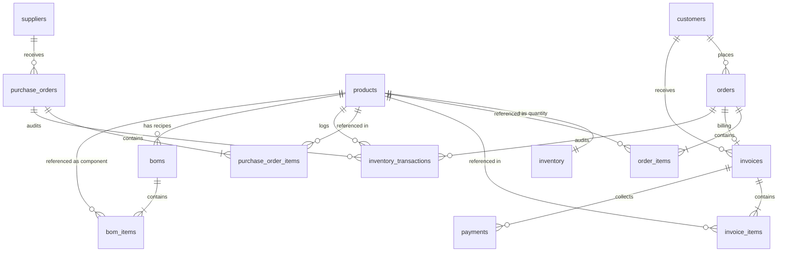

# Database Map: RL-ERP Backend

This document details the database schema, table definitions, columns, data types, foreign keys, relationships, indexes, and Alembic migrations history.

---

## 1. Schema Mapping by Table

Below is the dictionary of all tables mapped in the PostgreSQL database.

### Table: `users`
Stores system users, credentials, and access roles.

* **Columns**:
  * `id` (`Integer`): Primary Key. Auto-incremented.
  * `username` (`String`): Unique. Name of the user. Required (Not Null).
  * `email` (`String`): Unique. User email. Required (Not Null).
  * `hashed_password` (`String`): Stored password hash. Required (Not Null).
  * `role` (`String`): Authorization role. Defaults to `'staff'`. Required (Not Null).
* **Indexes & Constraints**:
  * Primary Key: `users_pkey` (`id`)
  * Unique Constraint: `users_username_key` (`username`)
  * Unique Constraint: `users_email_key` (`email`)
  * Index: `ix_users_id` (`id`)

---

### Table: `products`
Stores products (currently finished goods only).

* **Columns**:
  * `id` (`Integer`): Primary Key. Auto-incremented.
  * `name` (`String`): Product name. Required (Not Null).
  * `sku` (`String`): Stock keeping unit. Unique. Required (Not Null).
  * `hsn_code` (`String`): Harmonized System of Nomenclature code for tax categorization. Nullable.
  * `gst_rate` (`Integer`): Goods and Services Tax percentage (e.g. 5, 12, 18). Nullable.
  * `base_price` (`Float`): Standard wholesale or base price of product. Nullable.
  * `color` (`String`): Product color metadata. Nullable.
  * `unit` (`String`): Unit of measurement (e.g. KG, PCS, ROLLS). Nullable.
  * `description` (`String`): Detailed product description. Nullable.
  * `product_type` (`String`): Classification category (`RAW_MATERIAL`, `FINISHED_GOOD`, `SEMI_FINISHED`, `PACKAGING`, `CONSUMABLE`). Defaults to `'FINISHED_GOOD'`. Required (Not Null).
  * `standard_cost` (`Numeric(14, 2)`): Standard cost of the product. Defaults to `0.00`. Required (Not Null).
  * `default_supplier_id` (`Integer`): Foreign Key referencing `suppliers.id`. Nullable.
  * `is_active` (`Boolean`): Status flag for soft deactivation. Defaults to `True`. Required (Not Null).
* **Indexes & Constraints**:
  * Primary Key: `products_pkey` (`id`)
  * Unique Constraint: `products_sku_key` (`sku`)
  * Index: `ix_products_id` (`id`)

---

### Table: `customers`
Stores customer companies and contacts.

* **Columns**:
  * `id` (`Integer`): Primary Key. Auto-incremented.
  * `company_name` (`String`): Company name. Required (Not Null).
  * `contact_person` (`String`): Name of primary contact. Nullable.
  * `phone` (`String`): Contact phone number. Nullable.
  * `email` (`String`): Contact email. Nullable.
  * `gst_number` (`String`): Tax identification number (GSTIN). Nullable.
  * `address` (`String`): Billing/shipping address line. Nullable.
  * `city` (`String`): City. Nullable.
  * `state` (`String`): State. Nullable.
  * `pincode` (`String`): Postal zip code. Nullable.
  * `is_active` (`Boolean`): Soft deactivation flag. Defaults to `True`. Required (Not Null).
* **Indexes & Constraints**:
  * Primary Key: `customers_pkey` (`id`)
  * Index: `ix_customers_id` (`id`)

---

### Table: `inventory`
Tracks Finished Goods stock counts.

* **Columns**:
  * `id` (`Integer`): Primary Key. Auto-incremented.
  * `product_id` (`Integer`): Foreign Key referencing `products.id`. Unique. Nullable.
  * `quantity` (`Float`): Available stock amount. Defaults to `0`. Nullable.
  * `minimum_stock` (`Float`): Buffer count to trigger warnings. Defaults to `0`. Nullable.
* **Foreign Keys**:
  * Foreign Key Constraint: `inventory_product_id_fkey` (`product_id`) $\rightarrow$ `products`(`id`)
* **Relationships**:
  * `product`: `relationship("Product")` (one-to-one mapping in SQLAlchemy)
* **Indexes & Constraints**:
  * Primary Key: `inventory_pkey` (`id`)
  * Unique Constraint: `inventory_product_id_key` (`product_id`)
  * Index: `ix_inventory_id` (`id`)

---

### Table: `orders`
Tracks customer orders.

* **Columns**:
  * `id` (`Integer`): Primary Key. Auto-incremented.
  * `customer_id` (`Integer`): Foreign Key referencing `customers.id`. Nullable.
  * `contact_person` (`String`): Sales contact person. Nullable.
  * `po_number` (`String`): Purchase Order number from client. Nullable.
  * `status` (`String`): Order lifecycle status (`PENDING`, `PROCESSING`, `DISPATCHED`, `COMPLETED`, `CANCELLED`). Defaults to `'PENDING'`. Required (Not Null).
  * `remarks` (`String`): General remarks or delivery instructions. Nullable.
  * `total_amount` (`Numeric(14, 2)`): Total value of items. Defaults to `0`. Nullable.
  * `order_date` (`DateTime`): Timestamp of creation. Defaults to UTC now. Nullable.
* **Foreign Keys**:
  * Foreign Key Constraint: `orders_customer_id_fkey` (`customer_id`) $\rightarrow$ `customers`(`id`)
* **Indexes & Constraints**:
  * Primary Key: `orders_pkey` (`id`)
  * Index: `ix_orders_id` (`id`)

---

### Table: `order_items`
Contains detailed line items for orders.

* **Columns**:
  * `id` (`Integer`): Primary Key. Auto-incremented.
  * `order_id` (`Integer`): Foreign Key referencing `orders.id`. Nullable.
  * `product_id` (`Integer`): Foreign Key referencing `products.id`. Nullable.
  * `quantity` (`Float`): Amount ordered. Nullable.
  * `rate` (`Numeric(12, 2)`): Unit selling price. Nullable.
  * `amount` (`Numeric(14, 2)`): Calculated value (`quantity * rate`). Nullable.
* **Foreign Keys**:
  * Foreign Key Constraint: `order_items_order_id_fkey` (`order_id`) $\rightarrow$ `orders`(`id`)
  * Foreign Key Constraint: `order_items_product_id_fkey` (`product_id`) $\rightarrow$ `products`(`id`)
* **Indexes & Constraints**:
  * Primary Key: `order_items_pkey` (`id`)
  * Index: `ix_order_items_id` (`id`)

---

### Table: `invoices`
Tracks customer invoices.

* **Columns**:
  * `id` (`Integer`): Primary Key. Auto-incremented.
  * `invoice_number` (`String`): Formatted identifier (e.g. `INV-000001`). Unique. Required (Not Null).
  * `order_id` (`Integer`): Foreign Key referencing `orders.id`. Required (Not Null).
  * `customer_id` (`Integer`): Foreign Key referencing `customers.id`. Required (Not Null).
  * `subtotal` (`Numeric(14, 2)`): Amount before tax. Defaults to `0`. Nullable.
  * `tax_amount` (`Numeric(14, 2)`): Tax amount. Defaults to `0`. Nullable.
  * `total_amount` (`Numeric(14, 2)`): Gross invoice total (`subtotal + tax_amount`). Defaults to `0`. Nullable.
  * `status` (`String`): Invoice status (`DRAFT`, `ISSUED`, `PAID`, `PARTIALLY_PAID`, `CANCELLED`). Defaults to `'DRAFT'`. Required (Not Null).
  * `created_at` (`DateTime`): Invoice generation timestamp. Defaults to UTC now. Nullable.
  * `due_date` (`DateTime`): Payment deadline timestamp. Required (Not Null).
* **Foreign Keys**:
  * Foreign Key Constraint: `invoices_order_id_fkey` (`order_id`) $\rightarrow$ `orders`(`id`)
  * Foreign Key Constraint: `invoices_customer_id_fkey` (`customer_id`) $\rightarrow$ `customers`(`id`)
* **Indexes & Constraints**:
  * Primary Key: `invoices_pkey` (`id`)
  * Unique Constraint: `invoices_invoice_number_key` (`invoice_number`)
  * Index: `ix_invoices_id` (`id`)

---

### Table: `invoice_items`
Contains detailed line items for invoices.

* **Columns**:
  * `id` (`Integer`): Primary Key. Auto-incremented.
  * `invoice_id` (`Integer`): Foreign Key referencing `invoices.id`. Required (Not Null).
  * `product_id` (`Integer`): Foreign Key referencing `products.id`. Required (Not Null).
  * `quantity` (`Numeric(14, 2)`): Amount invoiced. Required (Not Null).
  * `rate` (`Numeric(14, 2)`): Unit billing rate. Required (Not Null).
  * `amount` (`Numeric(14, 2)`): Calculated value (`quantity * rate`). Required (Not Null).
* **Foreign Keys**:
  * Foreign Key Constraint: `invoice_items_invoice_id_fkey` (`invoice_id`) $\rightarrow$ `invoices`(`id`)
  * Foreign Key Constraint: `invoice_items_product_id_fkey` (`product_id`) $\rightarrow$ `products`(`id`)
* **Indexes & Constraints**:
  * Primary Key: `invoice_items_pkey` (`id`)
  * Index: `ix_invoice_items_id` (`id`)

---

### Table: `payments`
Tracks client payments against invoices.

* **Columns**:
  * `id` (`Integer`): Primary Key. Auto-incremented.
  * `invoice_id` (`Integer`): Foreign Key referencing `invoices.id`. Required (Not Null).
  * `amount` (`Numeric(14, 2)`): Received payment value. Required (Not Null).
  * `payment_method` (`String`): Payment method string (`CASH`, `BANK_TRANSFER`, `CHEQUE`, `UPI`, `CARD`). Required (Not Null).
  * `reference_number` (`String`): Bank trans ID or cheque number. Nullable.
  * `remarks` (`String`): Notes. Nullable.
  * `payment_date` (`DateTime`): Date payment was made. Defaults to UTC now. Required (Not Null).
  * `created_at` (`DateTime`): Timestamp payment record was written. Defaults to UTC now. Required (Not Null).
* **Foreign Keys**:
  * Foreign Key Constraint: `payments_invoice_id_fkey` (`invoice_id`) $\rightarrow$ `invoices`(`id`)
* **Indexes & Constraints**:
  * Primary Key: `payments_pkey` (`id`)
  * Index: `ix_payments_id` (`id`)

---

### Table: `inventory_transactions`
Logs all inventory movements for auditing.

* **Columns**:
  * `id` (`Integer`): Primary Key. Auto-incremented.
  * `product_id` (`Integer`): Foreign Key referencing `products.id`. Required (Not Null).
  * `order_id` (`Integer`): Foreign Key referencing `orders.id`. Nullable.
  * `purchase_order_id` (`Integer`): Foreign Key referencing `purchase_orders.id`. Nullable.
  * `quantity_change` (`Float`): Negative values represent deductions; positive values represent stock additions. Required (Not Null).
  * `transaction_type` (`String`): Identifier (`SALE`, `PURCHASE_RECEIPT`, `ADJUSTMENT`, `PRODUCTION_CONSUMPTION`, `PRODUCTION_OUTPUT`, `REVERSAL`, `ORDER_DISPATCH`, `ORDER_CANCEL`). Required (Not Null).
  * `remarks` (`String`): Description. Nullable.
  * `created_at` (`DateTime`): Creation timestamp. Defaults to UTC now. Required (Not Null).
* **Foreign Keys**:
  * Foreign Key Constraint: `inventory_transactions_product_id_fkey` (`product_id`) $\rightarrow$ `products`(`id`)
  * Foreign Key Constraint: `inventory_transactions_order_id_fkey` (`order_id`) $\rightarrow$ `orders`(`id`)
  * Foreign Key Constraint: `inventory_transactions_purchase_order_id_fkey` (`purchase_order_id`) $\rightarrow$ `purchase_orders`(`id`)
* **Indexes & Constraints**:
  * Primary Key: `inventory_transactions_pkey` (`id`)
  * Index: `ix_inventory_transactions_id` (`id`)

---

### Table: `suppliers`
Stores material or product vendors.

* **Columns**:
  * `id` (`Integer`): Primary Key. Auto-incremented.
  * `company_name` (`String`): Vendor name. Required (Not Null).
  * `contact_person` (`String`): Contact name. Nullable.
  * `phone` (`String`): Phone number. Nullable.
  * `email` (`String`): Email address. Nullable.
  * `gst_number` (`String`): Vendor GST ID. Nullable.
  * `address` (`String`): Address line. Nullable.
  * `city` (`String`): City. Nullable.
  * `state` (`String`): State. Nullable.
  * `pincode` (`String`): Postal code. Nullable.
  * `is_active` (`Boolean`): Soft-delete flag. Defaults to `True`. Required (Not Null).
* **Indexes & Constraints**:
  * Primary Key: `suppliers_pkey` (`id`)
  * Index: `ix_suppliers_id` (`id`)

---

### Table: `purchase_orders`
Tracks procurement orders issued to suppliers.

* **Columns**:
  * `id` (`Integer`): Primary Key. Auto-incremented.
  * `supplier_id` (`Integer`): Foreign Key referencing `suppliers.id`. Nullable.
  * `contact_person` (`String`): Supplier sales contact. Nullable.
  * `po_number` (`String`): Generated PO reference code (e.g. `PO-000001`). Nullable.
  * `status` (`String`): PO status (`DRAFT`, `SENT`, `PARTIALLY_RECEIVED`, `RECEIVED`, `CANCELLED`). Defaults to `'DRAFT'`. Required (Not Null).
  * `remarks` (`String`): Notes. Nullable.
  * `total_amount` (`Numeric(14, 2)`): Value of items. Defaults to `0`. Nullable.
  * `order_date` (`DateTime`): Timestamp of creation. Defaults to UTC now. Nullable.
* **Foreign Keys**:
  * Foreign Key Constraint: `purchase_orders_supplier_id_fkey` (`supplier_id`) $\rightarrow$ `suppliers`(`id`)
* **Indexes & Constraints**:
  * Primary Key: `purchase_orders_pkey` (`id`)
  * Index: `ix_purchase_orders_id` (`id`)

---

### Table: `purchase_order_items`
Contains detailed line items for purchase orders.

* **Columns**:
  * `id` (`Integer`): Primary Key. Auto-incremented.
  * `purchase_order_id` (`Integer`): Foreign Key referencing `purchase_orders.id`. Nullable.
  * `product_id` (`Integer`): Foreign Key referencing `products.id`. Nullable.
  * `quantity` (`Float`): Ordered quantity. Nullable.
  * `received_quantity` (`Float`): Quantity received so far. Defaults to `0`. Required (Not Null).
  * `rate` (`Numeric(12, 2)`): Unit buying rate. Nullable.
  * `amount` (`Numeric(14, 2)`): Calculated value (`quantity * rate`). Nullable.
* **Foreign Keys**:
  * Foreign Key Constraint: `purchase_order_items_purchase_order_id_fkey` (`purchase_order_id`) $\rightarrow$ `purchase_orders`(`id`)
  * Foreign Key Constraint: `purchase_order_items_product_id_fkey` (`product_id`) $\rightarrow$ `products`(`id`)
* **Indexes & Constraints**:
  * Primary Key: `purchase_order_items_pkey` (`id`)
  * Index: `ix_purchase_order_items_id` (`id`)

---

### Table: `boms`
Stores Bill of Materials recipe headers.

* **Columns**:
  * `id` (`Integer`): Primary Key. Auto-incremented.
  * `product_id` (`Integer`): Foreign Key referencing `products.id`. Required (Not Null).
  * `version` (`Integer`): Recipe version number. Defaults to `1`. Required (Not Null).
  * `is_active` (`Boolean`): Toggles active status. Defaults to `True`. Required (Not Null).
  * `notes` (`String`): General notes. Nullable.
  * `created_at` (`DateTime`): Timestamp. Defaults to UTC now. Required (Not Null).
  * `updated_at` (`DateTime`): Update timestamp. Defaults to UTC now, auto-updates. Required (Not Null).
* **Foreign Keys**:
  * Foreign Key Constraint: `boms_product_id_fkey` (`product_id`) $\rightarrow$ `products`(`id`)
* **Indexes & Constraints**:
  * Primary Key: `boms_pkey` (`id`)
  * Index: `ix_boms_id` (`id`)

---

### Table: `bom_items`
Stores line items/ingredients for a Bill of Materials.

* **Columns**:
  * `id` (`Integer`): Primary Key. Auto-incremented.
  * `bom_id` (`Integer`): Foreign Key referencing `boms.id` (cascade delete). Required (Not Null).
  * `component_product_id` (`Integer`): Foreign Key referencing `products.id`. Required (Not Null).
  * `quantity` (`Float`): Component quantity required. Required (Not Null).
  * `unit_of_measure` (`String`): Snapshot of unit at recipe definition. Required (Not Null).
  * `created_at` (`DateTime`): Creation timestamp. Defaults to UTC now. Required (Not Null).
* **Foreign Keys**:
  * Foreign Key Constraint: `bom_items_bom_id_fkey` (`bom_id`) $\rightarrow$ `boms`(`id`) (on delete cascade)
  * Foreign Key Constraint: `bom_items_component_product_id_fkey` (`component_product_id`) $\rightarrow$ `products`(`id`)
* **Indexes & Constraints**:
  * Primary Key: `bom_items_pkey` (`id`)
  * Index: `ix_bom_items_id` (`id`)
  * Unique Constraint: `uq_bom_items_bom_component` (`bom_id`, `component_product_id`)

---

## 2. Entity-Relationship Summary

---

## 3. Existing Alembic Migrations

The database schema evolves through versioned migrations managed by Alembic. The existing migration graph is as follows:

| Order | Revision ID | Parent Revision | Name / Description | Operations in Migration |
| :--- | :--- | :--- | :--- | :--- |
| 1 | `34703b4d90b2` | `None` (Root) | `baseline_existing_schema` | Empty script (re-uses existing tables from initial development). |
| 2 | `3ca6d7a4cbf0` | `34703b4d90b2` | `add_suppliers_table` | Alters column `orders.status` to `nullable=False`. (Suppliers table definition not in migration). |
| 3 | `aa0a97637be7` | `3ca6d7a4cbf0` | `schema_verification` | Empty script. |
| 4 | `f8851266edf1` | `aa0a97637be7` | `add_purchase_orders` | Empty script. |
| 5 | `88df91a57c03` | `f8851266edf1` | `add_purchase_order_reference_to_inventory_transactions` | Adds column `purchase_order_id` to `inventory_transactions` referencing `purchase_orders.id`. |
| 6 | `686fc3352513` | `88df91a57c03` | `add_received_quantity_to_purchase_order_items` | Adds column `received_quantity` to `purchase_order_items` (type: `Float`, default: `0`, non-nullable). |
| 7 | `92a21ef01c92` | `686fc3352513` | `add_product_type_to_products` | Adds column `product_type` to `products`, backfills existing rows to `'FINISHED_GOOD'`, and alters it to be non-nullable. |
| 8 | `c69c1886d559` | `92a21ef01c92` | `add_raw_material_fields_to_products` | Adds `standard_cost` and `default_supplier_id` to `products`, adds FK to `suppliers.id`, backfills cost to `0.00`, and alters it to be non-nullable. |
| 9 | `cf06b217a05b` | `c69c1886d559` | `create_bom_and_bom_item_tables` | Creates `boms` and `bom_items` tables with keys, index, and compound UniqueConstraint. |

> **Note on Migration Discrepancies:**
> Table creation queries for `suppliers`, `purchase_orders`, and `purchase_order_items` are not explicitly written in the Alembic versions files. They were either initialized prior to the adoption of Alembic or synced out-of-band using SQLAlchemy's metadata creation engines.
