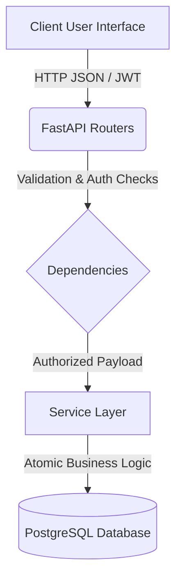

# Technical Reference Document (TRD)

## 1. System Architecture
RL-ERP employs a highly decoupled, modern backend architecture designed to ensure strict data integrity, isolated business logic, and high testability. The application is a unified monolith exposing RESTful APIs, designed to scale vertically or horizontally behind a load balancer.

### 1.1 High-Level Request Flow


### 1.2 Separation of Concerns
1. **API Layer (`app/routes/`)**: Handlers strictly responsible for receiving HTTP requests, enforcing Pydantic request validation, and returning standardized JSON responses. Business logic is strictly prohibited here.
2. **Dependency Layer (`app/dependencies/`)**: Injected into routes to handle repetitive tasks such as retrieving the current database session, verifying JWT tokens, and enforcing Role-Based Access Control (RBAC).
3. **Service Layer (`app/services/`)**: The core of the application. Services contain all atomic business logic (e.g., executing a production order and mutating inventory). They interact with the ORM and ensure operations are wrapped in safe database transactions.
4. **Data Access Layer (`app/models/`)**: SQLAlchemy 2.0 declarative models defining table structures and strict relationships.

## 2. Technology Stack

### Backend
- **Framework:** Python 3.10+, FastAPI (chosen for async capabilities and auto-generated OpenAPI schemas).
- **ORM:** SQLAlchemy 2.0 (for robust abstraction over SQL and strict Python typing).
- **Migrations:** Alembic (for versioned, safe database schema evolution and rollback support).
- **Validation:** Pydantic V2 (for lightning-fast payload parsing and runtime type checking).
- **Security:** Passlib (Bcrypt for password hashing) and Python-JOSE (JWT generation).
- **Testing:** Pytest, Pytest-Asyncio, Factory-Boy (>99% coverage targeting business services).

### Frontend
- **Framework:** React 19 (Vite) for rapid build times and modern hooks.
- **Language:** TypeScript (for type safety mirroring backend Pydantic schemas).
- **Styling:** Tailwind CSS v4 alongside Shadcn UI for rapid, accessible component development.
- **State Management:** Zustand (for global UI state) and TanStack Query (React Query) for server-state caching and synchronization.
- **Animations:** Framer Motion (for restraint-focused, premium micro-animations).

### Database
- **Engine:** PostgreSQL (chosen for ACID compliance, JSONB support, and robust transactional integrity critical for ERP systems).

## 3. Folder Structure

### Backend Structure (`/backend`)
```text
backend/
├── app/
│   ├── core/         # Configuration, database engine setup, security constants
│   ├── dependencies/ # Reusable FastAPI dependency injection (e.g., auth, DB sessions)
│   ├── models/       # SQLAlchemy 2.0 declarative base and table definitions
│   ├── routes/       # FastAPI APIRouter endpoints (Controllers)
│   ├── schemas/      # Pydantic V2 validation schemas for requests/responses
│   ├── services/     # Pure business logic and database transaction handling
│   └── utils/        # Generic helper functions
├── alembic/          # Database migration environment
├── tests/            # Comprehensive Pytest suite
│   ├── unit/         # Isolated service and boundary tests
│   ├── integration/  # Multi-service database workflow tests
│   └── security/     # RBAC and boundary penetration tests
└── main.py           # Application entry point & router inclusion
```

### Frontend Structure (`/frontend`)
```text
frontend/
├── src/
│   ├── app/          # App shell, routing definitions, Theme Providers
│   ├── assets/       # Static files (images, icons)
│   ├── components/   # Reusable UI components (buttons, tables, animations)
│   ├── features/     # Domain-specific components (e.g., auth forms, order tables)
│   ├── hooks/        # Custom React hooks
│   ├── lib/          # Utilities (Axios config, query client setup, cn)
│   ├── pages/        # Route-level page components (Landing, Dashboard)
│   ├── stores/       # Zustand state stores
│   ├── styles/       # Global CSS and Tailwind directives
│   └── types/        # TypeScript interfaces matching backend schemas
└── vite.config.ts    # Vite bundler configuration
```

## 4. API Architecture
The API follows RESTful conventions.
- Resources are pluralized (e.g., `/products`, `/orders`).
- Standard HTTP methods dictate operations (`GET`, `POST`, `PUT`, `PATCH`, `DELETE`).
- **Soft Deletes:** Deletions are typically handled via `PATCH /{resource}/{id}/deactivate` to maintain referential integrity in historical documents (like invoices), rather than hard `DELETE` operations.
- State changes (e.g., advancing an order status, executing a production job) are handled via explicit RPC-like POST/PATCH endpoints to isolate complex transactional logic (e.g., `POST /production-orders/{id}/execute`).

## 5. Security & Authentication Flow
- **Standard:** Stateless JSON Web Tokens (JWT).
- **Flow:**
  1. Client sends email/password to `POST /auth/login`.
  2. Server verifies against Bcrypt hash and issues a short-lived `access_token`.
  3. Client stores token securely and attaches it as a Bearer token in the `Authorization` header for subsequent requests.
- **Authorization (RBAC):** Roles (`admin`, `manager`, `staff`) are embedded in the database user model. Dependencies like `require_roles(["admin", "manager"])` intercept requests before they hit the route handler, rejecting unauthorized access with a `403 Forbidden`.

## 6. Database Architecture
The PostgreSQL database prioritizes strict relational integrity:
- **Foreign Keys:** Extensively used to link entities (e.g., `order_items` must link to a valid `product` and `order`).
- **Cascades:** Carefully configured. `order_items` cascade delete when an `order` is deleted, but `orders` do *not* cascade when a `customer` is deleted (customers are soft-deleted instead).
- **Unique Constraints:** Applied to logical bounds, such as preventing the same raw material from appearing twice in a single BOM (`bom_items_bom_id_component_product_id_key`).

## 7. State Management (Frontend)
- **Server State (TanStack Query):** Used for all data fetched from the API. Handles caching, background refetching, pagination, and loading/error states.
- **Client State (Zustand):** Used for global UI concerns that do not persist to the database (e.g., sidebar collapse state, current active theme, multi-step form progress).

## 8. Validation Strategy
- **Client-Side:** React Hook Form + Zod (to mirror Pydantic schemas) provides immediate feedback to users before network requests are dispatched.
- **Server-Side:** Pydantic strictly enforces type coercion, string length, and value bounds (e.g., blocking negative quantities) at the API boundary.
- **Database-Side:** SQLAlchemy models enforce non-null constraints, unique indexes, and referential integrity.

## 9. Error Handling
- The backend utilizes standardized HTTP status codes (400 for bad business logic/validation, 401 for auth failure, 403 for insufficient roles, 404 for missing resources).
- Service layer operations raise custom HTTPExceptions (e.g., "Insufficient inventory for dispatch") which the FastAPI exception handler formats into a standard JSON error response: `{"detail": "Error message here"}`.
- The frontend Axios interceptor catches these responses and dispatches Toast notifications to the user automatically.

## 10. Performance & Scaling Considerations
- **Pagination:** All list endpoints must implement `skip` and `limit` to prevent loading thousands of records into memory.
- **Database Indexes:** Applied explicitly to highly-queried foreign keys (e.g., `customer_id` on orders, `product_id` on inventory) to speed up joins.
- **Statelessness:** The backend holds no session state. It scales horizontally seamlessly by deploying multiple instances behind a load balancer, provided they point to the same PostgreSQL cluster.
- **Concurrency:** Critical inventory mutations (dispatch, production execution) must be evaluated for race conditions, utilizing row-level database locks (`SELECT ... FOR UPDATE`) in future iterations to prevent overselling stock during simultaneous requests.
