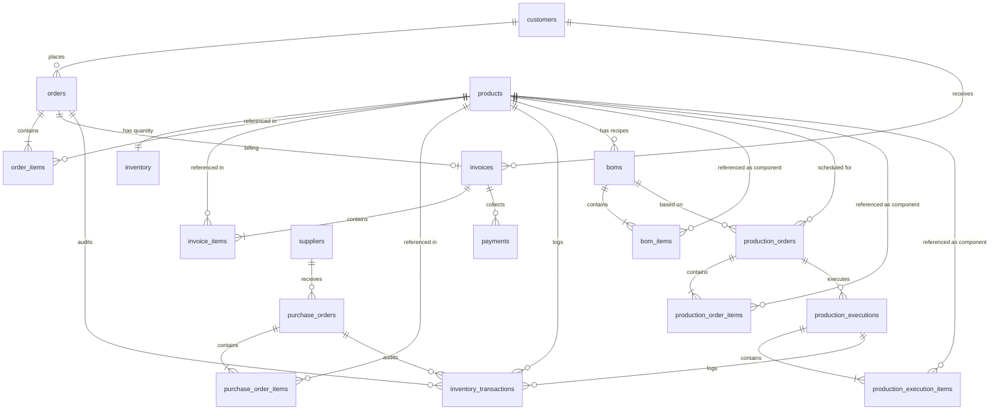

# System Architecture - RL-ERP

## 1. Overview
RL-ERP is built using a decoupled architecture separating the front-end user interface from the backend business logic and database.

```text
  [ Client User Interface ]
             │
             │ HTTP (JSON payloads / JWT auth)
             ▼
    [ FastAPI Routers ]
    (Data Validation, Auth, Role Checks)
             │
             │ 
             ▼
    [ Domain Service Layer ]
    (e.g., OrderService, InvoiceService, ProductionService)
             │
             │ SQLAlchemy ORM (PostgreSQL driver)
             ▼
     [ PostgreSQL DB ]
```

## 2. Module Relationships & Data Flow

* **Authentication**: Secures access via JWT. Users are assigned one of three roles (`admin`, `manager`, `staff`), which are checked dynamically at the route level via dependencies.
* **Products & Classification**: Central catalog. Products are classified (`FINISHED_GOOD`, `SEMI_FINISHED`, `RAW_MATERIAL`, `PACKAGING`, `CONSUMABLE`) and store Standard Costing metadata.
* **BOM & Recipes (Service Layer)**: Handled by `BOMService`. Finished/Semi-Finished products can have active Recipes (BOMs) specifying component products and their requirements.
* **Sales / Orders (Service Layer)**: Handled by `OrderService`. Enforces strict state machine. Customer orders deduct `FINISHED_GOOD` stock from the inventory module upon dispatch.
* **Invoicing (Service Layer)**: Handled by `InvoiceService`. Generates invoices directly from dispatched orders and manages state transitions through payment lifecycle.
* **Payments (Service Layer)**: Handled by `PaymentService`. Records payments against issued invoices, enforces state transition invariants, and generates outstanding balances and aging reports.
* **Procurement / PO (Service Layer)**: Handled by `PurchaseOrderService`. Purchase orders issued to suppliers increment inventory stock upon receipts validation.
* **Production Orders (Service Layer)**: Handled by `ProductionService`. Schedules production runs. Pulls requirements from the active BOM, scales quantities based on target yield, checks raw materials stock levels in the inventory, and snapshots static requirement logs.
* **Production Execution (Service Layer)**: Handled by `ProductionService`. Performs physical stock consumption and finished good additions, records execution audits, creates transaction history logs, and handles rollback operations atomically.
* **Inventory (Service Layer)**: Handled by `InventoryService`. Centralized stock management, minimum stock thresholds, and low-stock alerting.

## 3. Database ER Diagram


